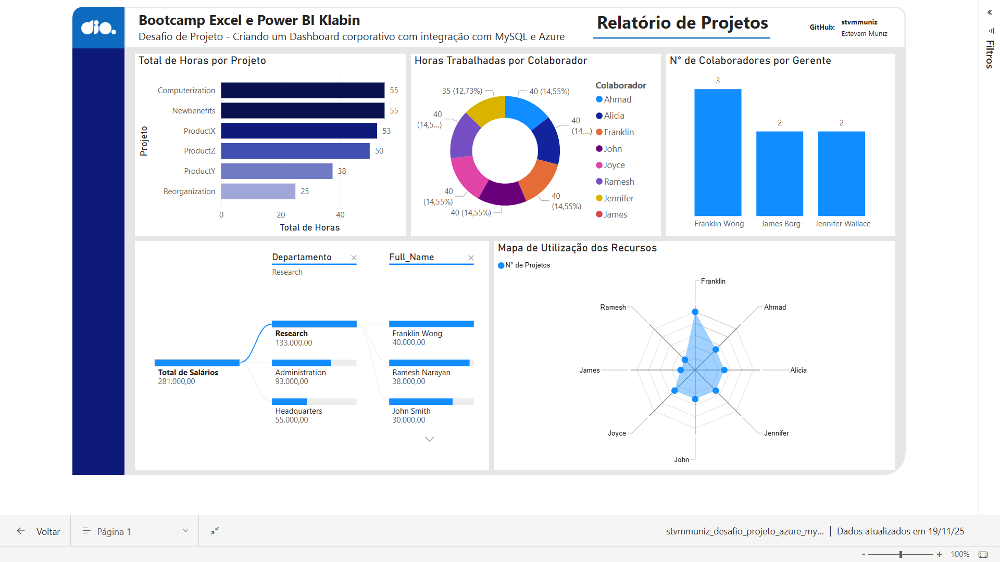

## Introdução
Este projeto apresenta, na prática, as etapas de coleta, obtenção e transformação de dados utilizando Power BI e MySQL na Azure. Ele foi desenvolvido para atender ao Desafio de Projeto *“Criando um Dashboard Corporativo com Integração com MySQL e Azure”*, que integra o Bootcamp Klabin – Excel e Power BI Dashboards na DIO.

## Contexto Inicial:

Aplicar as etapas de coleta, obtenção e transformação de dados com Power BI e MySQL na Azure a partir das diretrizes de estrutura do banco de dados "Company" forncecida durante asl aulas do curso.

### Arquivos fornecidos:

[dio_script_bd_company.sql](dio_script_bd_company.sql)<br>
[dio_insercao_de_dados_e_queries.sql](dio_insercao_de_dados_e_queries.sql)

## Atividades realizadas:
- [X] Criação de uma instância na Azure para MySQL;
- [X] Criação do Banco de dados com base nos arquivos fornecidos;
- [X] Integração do Power BI com MySQL no Azure;
- [X] Verificado possíveis problemas na base a fim de realizar a transformação dos dados;
- [X] Foram realizadas as seguintes transformações de tipos de dados:
	* *= Table.TransformColumnTypes(azure_company_departament,{{"Mgr_ssn", Int64.Type}})*
	* *= Table.TransformColumnTypes(azure_company_dependent,{{"Essn", Int64.Type}})*
	* *= Table.TransformColumnTypes(azure_company_employee,{{"Ssn", Int64.Type}, {"Salary", Currency.Type}, {"Super_ssn", Int64.Type}})*
	* *= Table.TransformColumnTypes(azure_company_works_on,{{"Essn", Int64.Type}})*
- [X] Não foram encontrados valores nulos com necessidade de remoção;
- [X] Foi identificado valor null na coluna *Super_ssn* para o colaborador **James Borg** (Gerente do Headquarters), todos os demais colaboradores estavam atribuídos em algum gerente. Os gerentes dos departamentos *Admnistration* e *Research* estavam subordinados ao gerente do *Headquarters*;
- [X] Não foram encontrados departamentos sem gerente;
- [X] O número de horas projeto pode ser visto relatório através do visual *"Total de Horas por Projeto"*;
- [X] Na tabela *employee*, a coluna complexa *Adress* foi dividida em quatro colunas sendo: *Number, Street, City e State* respectivamente;
- [X] Foi criada a tabela *merge_employee_department*  com as colunas *Ssn, Full_Name e Department*. Foi utilizado como fonte a Mescla das tabelas *employee* e *department* e eliminado todas as colunas desnecessárias. A mescla das colunas *Fname*  e *Lname*  deu origem a coluna *Full_Name*;
- [X] Optei por criar uma **consulta SQL** para realizar a junção dos colaboradores e seus respectivos nomes de gerentes. Essa consulta já traz as colunas *Fname* e *Lname* concatenadas, tanto dos colaboradores quanto dos gerentes. Isso elimina a necessidade mesclar essas colunas no **Power Query**. Para deixar os dados organizados e prontos para a utilização no relatório foi acrescentado na Consulta SQL a ordenação dos dados pela coluna *employee*.
Neste caso, a escolha pela Consulta SQL teve o objetivo de simplificar o trabalho a ser realizado, visto que o carregamento no Power BI se torna muito mais limpo, sem necessidade de mais transformações no power query.

	**Query utilizada:**
	```
	-- Query para listar colaboradores e seus respectivos gerentes.

	SELECT 
    	CONCAT(e.Fname, ' ', e.Lname) AS Employee_Name,
    	CONCAT(m.Fname, ' ', m.Lname) AS Manager_Name
	FROM employee e
	INNER JOIN employee m 
    	ON e.Super_ssn = m.Ssn
	ORDER BY 
    	Employee_Name,
    	Manager_Name
		;*
	````
- [X] Foi criado a tabela *merge_department_location* a partir da mescla das tabelas *department* e *dept_locations* com o objetivo de criar uma combinação única entre departamento e local para ser usado em módulos futuros do curso.
- [X] **No Power Query, mesclar e acrescentar são duas maneiras diferentes de juntar tabelas**, e a escolha entre uma e outra depende do resultado que queremos atingir.<br><br>
Ao usarmos mescla de consultas, estamos basicamente colocando as informações de uma tabela ao lado da outra, usando uma coluna em comum para fazer essa ligação. É como adicionar novas colunas através de um PROCV Excel. Utilizamos esta operação quando precisamos completar uma tabela com dados que estão em uma outra tabela, por isso utilizamos esta operação no caso anterior.<br><br>
Já acrescentar consultas é diferente, pois não coloca dados ao lado, e sim empilha tabelas, como se estivesse juntando várias listas em uma só, para isso é necessário que as ambas as tabelas tenham a mesma estrutura. É útil quando temos dados de diversas fontes com a mesma estrutura e precisamos unir tudo em uma única tabela maior.
- [X] Posteriormente houve a necessidade agrupar os dados da tabela *merge_employee_department* para que fosse possível saber a quantidade de colaboradores por gerente. Essa transformação foi feita no power query. 

	* Uma outra opção poderia ser alterar a SQL da consulta feita anteriormente para a Query abaixo:

```
	-- Query para listar gerentes e a quantidade decolaboradores que estão associadosa a eles.
	
	SELECT 
    	CONCAT(m.Fname, ' ', m.Lname) AS Manager_Name,
    	COUNT(e.Ssn) AS Employee_Quantity
	FROM employee e
	INNER JOIN employee m 
    	ON e.Super_ssn = m.Ssn
	GROUP BY 
    	Manager_Name
	ORDER BY 
    	Manager_Name;
```
- [X] Por fim foram deletadas todas as colunas desnecessárias de todas as tabelas
		

## Print do Relatório Publicado no Power BI Service:

- [X] Página 1: Relatório de Projeto




 ## Arquivos:
 
 - [X] Projeto Completo no Power BI: [Clique aqui para visualizar o arquivo.](stvmmuniz_desafio_projeto_azure_mysql_ver02)
 
 - [X] Query da consulta employee_manager: [Clique aqui para visualizar o arquivo.](stvmmuniz_query_employee_manager.sql)
 

     
<br><br>
**Escrito por:** *stvmmuniz*
